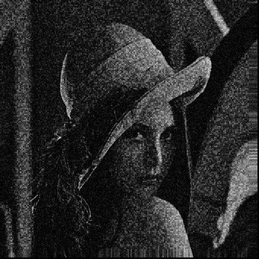

# LLNet tensorflow实现

LLNet is a simple reconstructed network by using SSDA, This repo reimplements LLNet using tensorflow

## Usage

1. Download graylevel images from `http://decsai.ugr.es/cvg/dbimagenes/` to an any path 
and place all the images to `root_path/dataset`

2. Modify the `root_dir` in `data_gen.py` to `root_path/dataset` and RUN this program
to generate the training data with `python data_gen.py`.

3. Modify the `root_path` in `write_tfrecords.py` and RUN this program to generate
the tfrecords file with `python write_tfrecords.py`

4. Modify the `root_path` in `pretrain.py` and RUN with `python pretrain.py` to generate
the pretrained model.

5. Modify the `root_path` in `check_pretrained_model.py` and 
RUN with `python check_pretrained_model.py` to generate the pretrained model for finetuning.

6. Modify the `root_path` in `finetune_mix_with_tfrecord.py` and RUN 
with `python finetune_mix_with_tfrecord.py` for finetuning.

7. RUN shell
```shell
tensorboard --logdir=./logs/finetune/XX-XX-XX-XX-XX
``` 
to look at the finetune progress.


My result:

Original images:


Corrupted images:


Reconstructed images:
